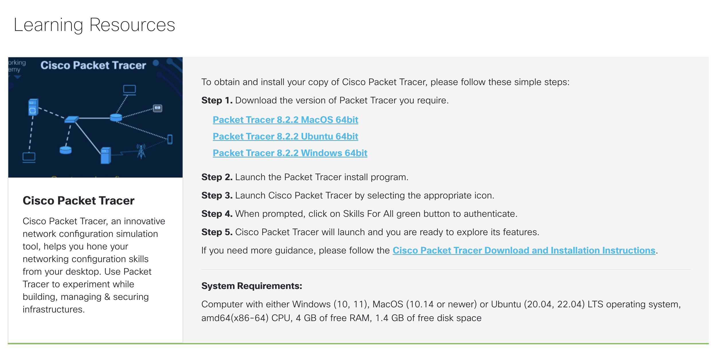
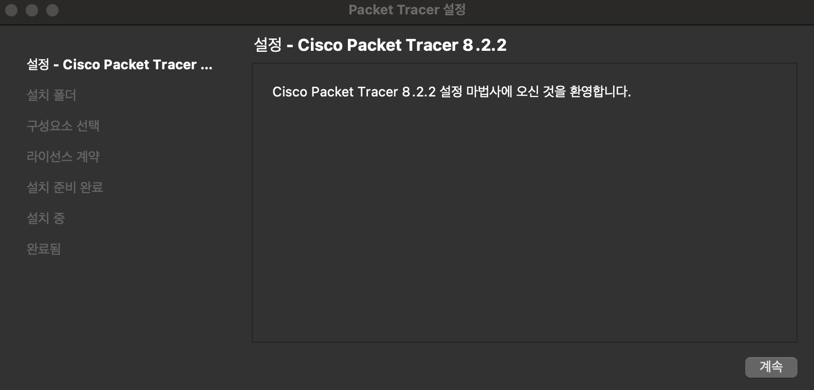
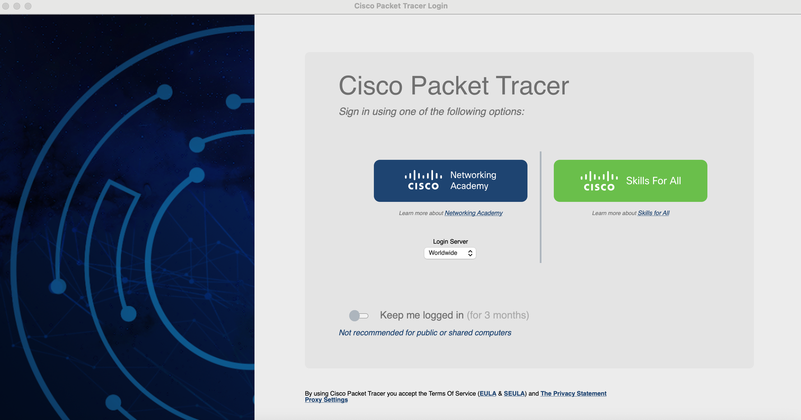
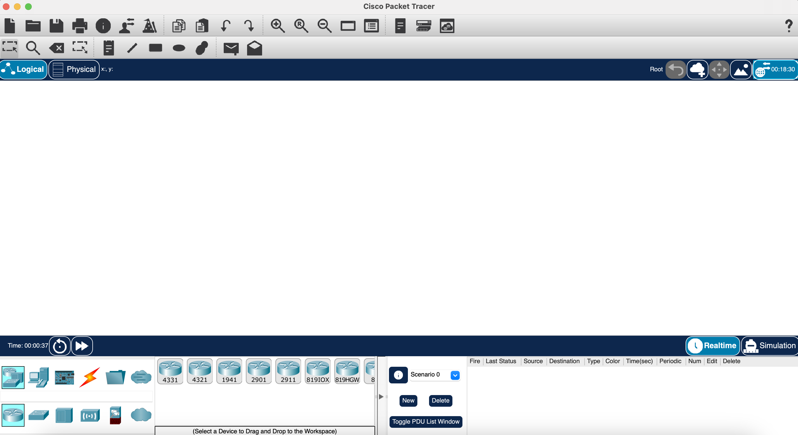
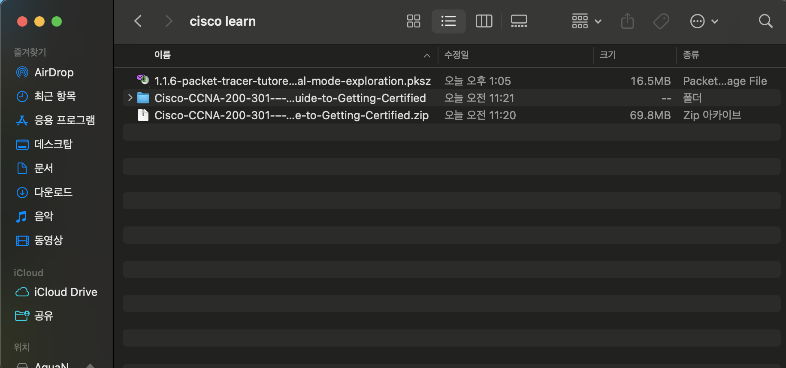
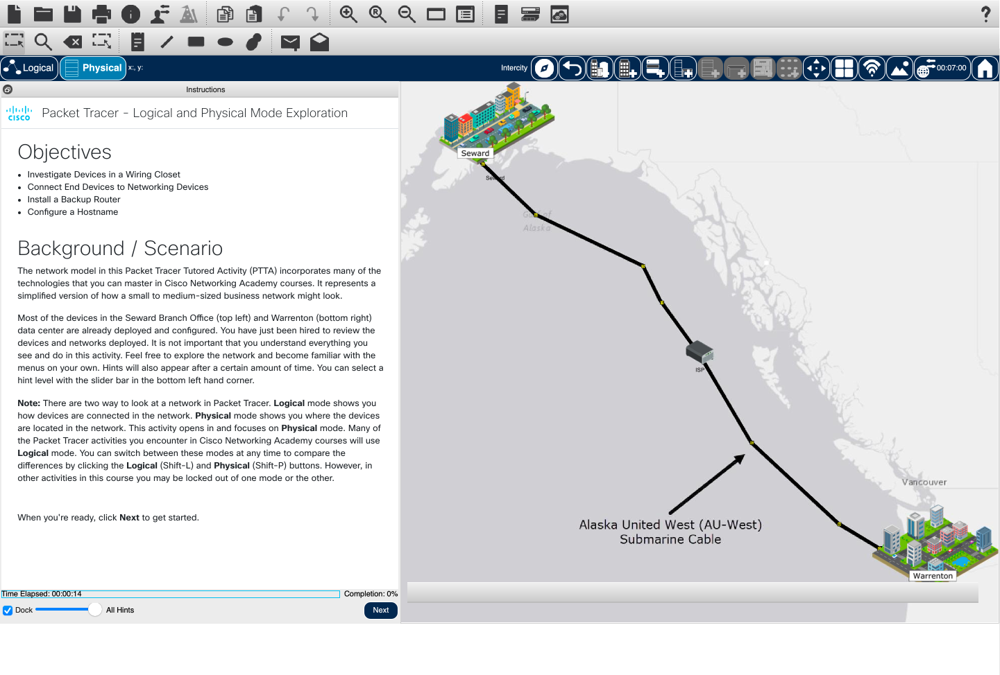

# 프로그램 인스톨 방법

## 회원가입

netacad 사이트를 방문하여 회원 가입을 시작한다. [https://www.netacad.com/](https://www.netacad.com/)

## Course 등록

링크 : [https://www.netacad.com/courses/getting-started-cisco-packet-tracer?courseLang=en-US](https://www.netacad.com/courses/getting-started-cisco-packet-tracer?courseLang=en-US)

다음의 강의에 Cisco Packet Tracer 를 사용하는 방법을 알려줍니다.\
다음 강의를 수강하여 바뀔수 있는 다운로드 주소등을 참고하세요.

## Cisco Packet Tracer

> [!NOTE]
> Cisco 에서 제공하는 무료 프로그램이다.\
> 다양한 네트워크 설정으로 소프트 S/W에서 실제 테스트를 해볼 수 있다.

다운로드 링크 : [https://www.netacad.com/resources/lab-downloads?courseLang=en-US](https://www.netacad.com/resources/lab-downloads?courseLang=en-US)

다음과 같이 다운로드를 할 수 있다.

설치가 완료되고 실행을하면 로그인 페이지가 나온다.

살짝의 버그가 있는듯 다시 실행 하면 로그인되어 있는 것을 확인할 수 있었다

## 파일 불러오기

또한 다음과 같은 파일들을 실행하여 설정되어있는 파일을 가져올 수도 있다

cisco 파일 종류는 다음과 같다

| 확장자명 | 설명 |
| --- | --- |
| .pka | Packet Tracer Activity 파일로, Cisco Packet Tracer에서 연습 및 평가 활동(Activity) 파일을 저장하는 용도입니다. |
| .pkt | Packet Tracer Network 파일로, Cisco Packet Tracer에서 네트워크 토폴로지 및 설정이 포함된 프로젝트 파일입니다. |
| .pksz | Compressed Packet Tracer File로, .pkt 파일을 압축한 버전입니다. 네트워크 프로젝트를 저장할 때 사용됩니다. |
| .pkz | Zipped Packet Tracer File로, .pka 파일을 압축한 버전이며, 활동(Activity) 파일을 패키징하여 공유하기 위한 용도로 사용됩니다. |